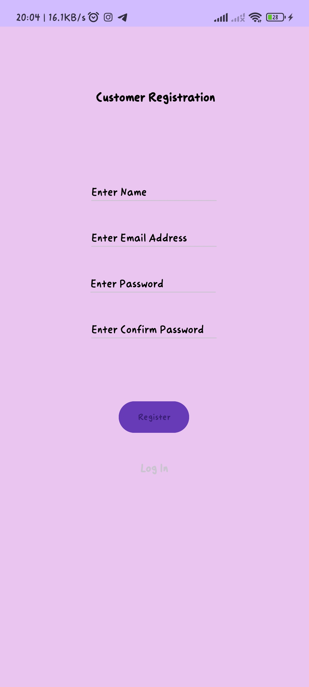

# The-Bloom-Room

## Overview

The-Bloom-Room is an Android application designed for managing a flower shop. It provides two user roles: admin and customer. Admins can manage categories, flowers, view orders, and process orders. Customers can view available flowers, place orders, and view their order history.

## Features

### Admin Dashboard

- **Categories:** Add, edit, or delete flower categories.
- **Flowers:** Add, edit, or delete flowers within categories.
- **View Orders:** View orders placed by customers.
- **Process Order:** Change the status of orders to indicate processing.

### Customer Dashboard

- **View Flowers:** Browse available flowers and place orders.
- **View Order:** View order history.
## Screenshots

Here are some screenshots of the application:

### Main Screen


### Admin Login/Register
  

### Customer Login/Register
  

### Admin Dashboard


       

### Customer Dashboard
 

    

## Getting Started

### Prerequisites

- Android Studio installed on your machine. You can download it from [here](https://developer.android.com/studio).
- JDK (Java Development Kit) installed. You can download it from [here](https://www.oracle.com/java/technologies/javase-jdk11-downloads.html).

### Clone the Repository

1. Clone the repository:

    ```
    git clone https://github.com/sandazz/The-Bloom-Room.git
    ```

2. Open Android Studio.

3. Click on "Open an existing Android Studio project".

4. Navigate to the directory where you cloned the repository and select the project.

### Build and Run

1. Build the project by selecting `Build > Make Project` from the menu bar.

2. Connect your Android device to your computer using a USB cable, or use an emulator.

3. Select your device from the list of available devices in Android Studio.

4. Run the application by clicking the green play button in the toolbar, or select `Run > Run 'app'`.

## Contact

If you have any questions or suggestions regarding this project, feel free to contact the project owner:

- Sandas Gimhana
- sandazzzg1999@gmail.com


